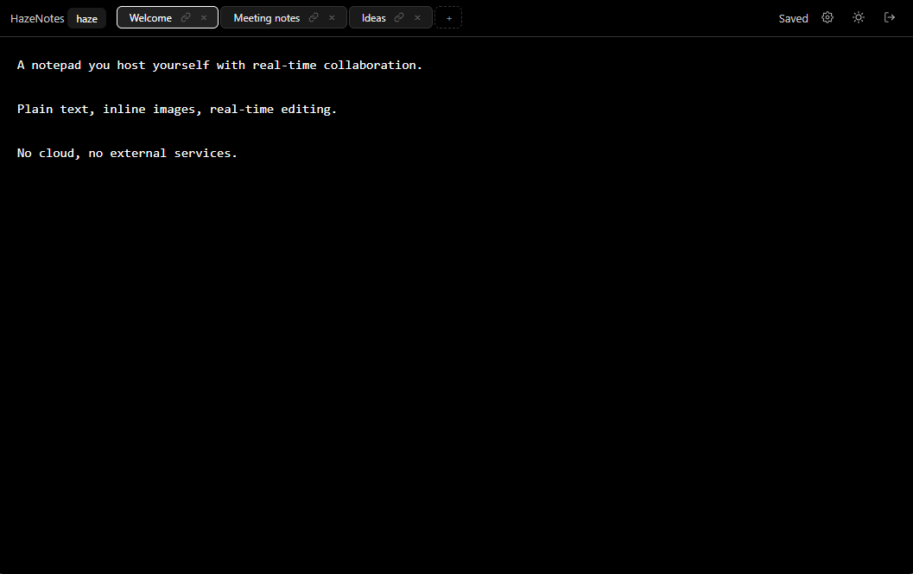

<p align="center">
  
</p>

<h1 align="center">HazeNotes</h1>

<p align="center">
  Self-hosted, multi-user notes with real-time collaboration.<br>
  One process, one SQLite file, no services to run.
</p>

<p align="center">
  <a href="https://github.com/hazekezia/HazeNotes/releases"></a>
  
  
  
</p>

<p align="center">
  
</p>

## Quick start

Needs Docker, or Python 3.10+ (the image ships 3.12). On first start, open `http://localhost:8123` and register the first account; `GET /health` answers `{"status": "ok"}` once the app is up.

### Docker Compose

```bash
cp .env.example .env       # the compose file reads it (env_file)
docker compose up -d --build
```

The stack is described in [`docker-compose.yml`](docker-compose.yml): it publishes port `8123` on every interface, so other machines on your LAN open `http://<this-host-ip>:8123`. All mutable state lives in the `hazenotes-data` volume (`/app/storage`). Before exposing the app to the internet, read [Deployment and operations](docs/DEPLOYMENT.md).

### Docker (build and run)

```bash
docker build -t hazenotes .
docker run -d --name hazenotes \
  --restart unless-stopped \
  --env-file .env \
  -p 8123:8123 \
  -v hazenotes-data:/app/storage \
  hazenotes
```

`-p 8123:8123` publishes the port on every interface (LAN included); drop `--env-file .env` if you did not create that file. For an internet-facing host use `-p 127.0.0.1:8123:8123` and keep a TLS-terminating proxy in front.

### Docker cloud

Point the platform at this repository (it builds the `Dockerfile`) and configure it in the dashboard:

- **Environment variables** — set the `NOTEPAD_*` variables from the table below there; no `.env` file is involved.
- **Port** — the image listens on the platform's `$PORT` when it provides one, otherwise on `NOTEPAD_PORT`, then `8123`.
- **Volume** — mount persistent storage at `/app/storage`, or every redeploy wipes the notes.
- **Replicas** — run exactly one: SQLite, the login limiter and the WebSocket manager all assume a single process ([details](docs/DEPLOYMENT.md#container-platforms-docker-cloud)).

### Manual (Python)

```bash
python3 -m venv .venv
source .venv/bin/activate
pip install -r requirements.txt
uvicorn hazenotes.main:app --host 0.0.0.0 --port 8123
```

Run it from the repository root: a `.env` in that directory is read automatically, state goes to `./storage/data` (SQLite) and `./storage/images`, and `--host 0.0.0.0` makes the app reachable from your LAN. `python3 -m hazenotes.main` also works and honours `NOTEPAD_HOST` / `NOTEPAD_PORT`.

## Configuration (.env)

Copy [`.env.example`](.env.example) to `.env` and edit it. Direct runs (uvicorn, `python3 -m hazenotes.main`) read that file from the working directory automatically; containers get real environment variables instead:

| How you run it | How `.env` reaches the app |
|---|---|
| `uvicorn` / `python3 -m hazenotes.main` | the `.env` in the working directory is read at start-up |
| Docker Compose | `env_file: .env` in [`docker-compose.yml`](docker-compose.yml) |
| `docker run` | `--env-file .env` (or `-e NOTEPAD_PORT=9000` per setting) |
| systemd | `EnvironmentFile=/opt/HazeNotes/.env` in the unit (see [Deployment and operations](docs/DEPLOYMENT.md#run-it-as-a-service-systemd)) |
| Docker cloud / PaaS | variables set in the platform dashboard; no file involved |

Real environment variables always win over the file, and the file is parsed as UTF-8 so a BOM does not break it.

| Variable | Default | Description |
|---|---|---|
| `NOTEPAD_AUTH` | `TRUE` | `FALSE` disables authentication entirely (single-user mode, owner `anonymous`). |
| `NOTEPAD_HOST` | `0.0.0.0` | Bind address used by `python -m hazenotes.main`. |
| `NOTEPAD_PORT` | `8123` | Bind port used by `python -m hazenotes.main`, and the port the container listens on. |
| `PORT` | *(unset)* | Fallback when `NOTEPAD_PORT` is not set — the variable container platforms inject. |
| `NOTEPAD_DATA_DIR` | `./storage/data` | SQLite database directory (`notepad.db`). |
| `NOTEPAD_IMAGES_DIR` | `./storage/images` | Uploaded image directory. |
| `NOTEPAD_SESSION_TTL_HOURS` | `168` | Session lifetime (7 days). |
| `NOTEPAD_MAX_UPLOAD_BYTES` | `20971520` | Upload cap (20 MB), enforced while the body streams in. |
| `NOTEPAD_LOGIN_RATE_LIMIT` | `10` | Failed logins per IP before `429`. |
| `NOTEPAD_LOGIN_RATE_WINDOW` | `300` | Rate-limit window, in seconds. |

Settings are read once at process start, so a change needs a restart. Two limits are constants in `hazenotes/config.py` rather than environment variables: note body 1 MB (`MAX_NOTE_BYTES`) and note title 120 characters (`MAX_TITLE_LEN`).

## Documentation

| Document | What is inside |
|---|---|
| [Usage guide](docs/USAGE.md) | For the people who write the notes: accounts, writing, pictures, sharing, FAQ, glossary. |
| [Deployment and operations](docs/DEPLOYMENT.md) | Production checklist, nginx / Caddy, systemd unit, backup and restore, health and logs, upgrades. |
| [Security model](docs/SECURITY.md) | What is protected, what the password and session handling does, and every known limitation. |
| [HTTP API](docs/API.md) | Every endpoint with its auth requirement and limits. |
| [Development](docs/DEVELOPMENT.md) | Project layout, data model, request lifecycle, real-time flow, legacy migration, tests. |

## Development

```bash
python tests/test_api.py    # assert-based, 55 checks, no framework needed
pytest tests                # optional, works too
```

Internals are documented in [docs/DEVELOPMENT.md](docs/DEVELOPMENT.md).

## License

GNU General Public License v3 — see [LICENSE](LICENSE).

